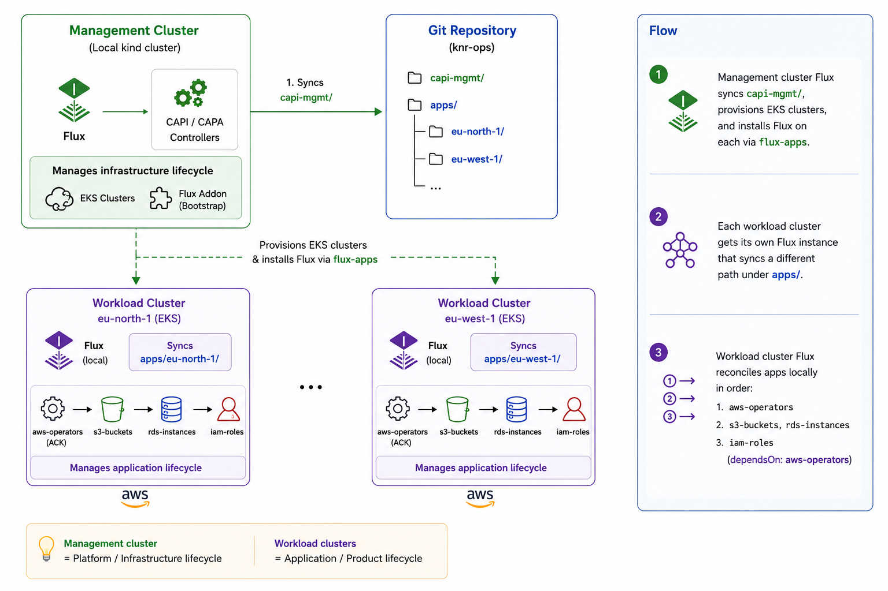

# knr-ops
## kubernetes-native resource operations

A GitOps pattern for managing cloud infrastructure through the Kubernetes API:
no Terraform, no DSLs, no state files, no second toolchain. This repository is
a working reference implementation of that pattern on AWS. **It is not a
product**: fork it, strip it down, and adapt the layout to your own cloud and
clusters.

A local [kind](https://kind.sigs.k8s.io/) cluster bootstraps
[Flux](https://fluxcd.io/), which then reconciles everything else from this
repository:

- AWS EKS workload clusters provisioned via
  [CAPA](https://cluster-api-aws.sigs.k8s.io/)
- per-cluster Flux instances delivered through CAPI addons
- application workloads (the [ACK](https://aws-controllers-k8s.github.io/docs/)
  S3, RDS, and IAM operators managing secure S3 buckets, PostgreSQL instances,
  and read-only IAM roles) running on each workload cluster

After the one-time bootstrap, **everything is declared in Git as YAML**.
1 CAPI cluster creates: 2 clusters, 4 node pools, 2 regions, 2 S3 buckets,
2 RDS instances, 1 user, 1 role. 0 HCL, 0 state files.



## Who this is for

Platform engineers who already run Kubernetes and want to manage their own
cloud infrastructure with the same API, RBAC, audit trail, and GitOps workflow
they use for workloads. If you're reaching for Terraform/OpenTofu, Pulumi, or
Crossplane to stand up cloud resources for Kubernetes, this pattern is the
alternative: the cluster you already operate becomes the control plane. It is
not a developer self-service portal; you are the consumer.

## Problems the pattern solves

- **State files**: drift, locking, corruption. Controllers reconcile actual
  state continuously instead of diffing a snapshot.
- **The plan/apply gap**: PRs are reviewed as **rendered** Flux diffs (blast
  radius, image changes, render failures) by an in-cluster
  [konflate](https://github.com/home-operations/konflate) instance: you review
  byte-for-byte what reconciles. See [docs/konflate.md](docs/konflate.md).
- **Two toolchains**: HCL for infra, YAML for workloads. One control plane
  means RBAC, policy, and audit cover both.
- **Lifecycle split**: Terraform builds the cluster but can't manage what's
  in it. CAPI + Flux is one dependency graph from cluster to workload.

## Prerequisites

- Mise
- GitHub personal access token (PAT) with read access to this repo for the AWS
  profile
- AWS credentials and quotas established for the AWS profile

## Quickstart

```sh
mise trust                  # to enable mise in this repository
mise install                # installs tools pinned in mise.toml (kubectl, kind, flux, ...)
cp .env.example .env        # AWS profile: fill in GitHub PAT and AWS settings
mise run sops-keygen        # first time only: age key for SOPS
mise run bootstrap          # kind cluster + Flux; everything else is GitOps
flux get kustomizations --watch
mise run validate           # build every kustomize overlay (mirrors CI)
mise run teardown           # full teardown (EKS, AWS resources, kind)
```

### Mise profiles

The shared toolchain is defined in `mise.toml`. AWS-specific tools are layered
through `mise.aws.toml`; use the `aws` profile when those tools are needed.
The `mac` profile is still work in progress. It creates the management kind
cluster and installs the Flux Operator, but does not configure GitOps sync or
provision AWS resources:

```sh
mise -E mac install
mise -E mac run bootstrap
mise -E mac run teardown
```

The Flux Operator chart is pulled anonymously. The AWS profile requires a
GitHub PAT so Flux can clone this repository; the Mac profile does not require
GitHub or AWS credentials.

The Mac teardown deletes only the `capi-mgmt` kind cluster. The default
teardown path suspends Flux and removes the AWS-managed infrastructure.

## Documentation

| Page | Contents |
|---|---|
| [docs/architecture.md](docs/architecture.md) | Architecture diagram, reconciliation order, how workload apps are delivered |
| [docs/aws-iam.md](docs/aws-iam.md) | EKS Pod Identity, ACK controller IAM roles, per-cluster reader roles, the `knr-ops-reader` console user |
| [docs/workload-resources.md](docs/workload-resources.md) | S3 bucket security posture, RDS instances, known limitations |
| [docs/konflate.md](docs/konflate.md) | Rendered Flux PR review: in-cluster konflate instance, write-back to PRs, tokens |
| [docs/secrets.md](docs/secrets.md) | SOPS + age secret management, key setup, credential rotation |
| [docs/operations.md](docs/operations.md) | Prerequisites, AWS service quotas, configuration, bootstrap, verification, teardown, validation |
| [docs/extending.md](docs/extending.md) | Adding a workload cluster, adding apps to the workload clusters, adding other providers (Azure, Talos, k0smotron) |

## Repository layout

```
├── bootstrap.sh / teardown.sh     One-time imperative bootstrap / full teardown
├── docs/                          Detailed documentation (see table above)
├── capi-mgmt/                     Synced by the MANAGEMENT cluster's Flux
│   ├── infrastructure/            cert-manager, CAPI operator, CAPA identity,
│   │                              ACK controllers, pod-identity roles,
│   │                              account-global IAM (reader console user),
│   │                              konflate (rendered Flux PR review)
│   ├── capi-providers/            capi-system, capa-system (SOPS creds),
│   │                              caaph-system
│   ├── addons/flux-apps/          Installs Flux on each workload cluster
│   │                              (HelmChartProxy + ClusterResourceSets)
│   └── clusters/                  EKS cluster defs (eu-north-1, eu-west-1;
│                                  ARM + GPU MachinePools)
└── apps/                          Synced by each WORKLOAD cluster's Flux
    ├── base/                      ACK S3/RDS/IAM controllers, Bucket CRs,
    │                              DBInstance CRs, reader Role CRs
    ├── eu-north-01/               Per-cluster overlay (sync target)
    └── eu-west-01/                Per-cluster overlay (sync target)
```
