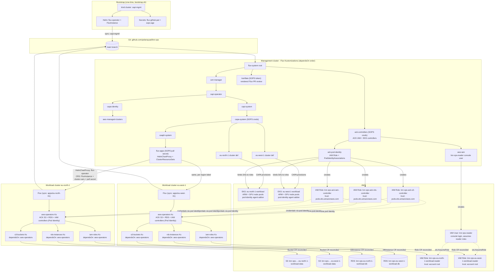

# Architecture

GitOps-driven [Cluster API](https://cluster-api.sigs.k8s.io/) (CAPI) management
platform. A local [kind](https://kind.sigs.k8s.io/) cluster bootstraps
[Flux](https://fluxcd.io/), which then reconciles everything else from this
repository — AWS EKS workload clusters provisioned via
[CAPA](https://cluster-api-aws.sigs.k8s.io/), per-cluster Flux instances
delivered through CAPI addons, and application workloads (the
[ACK](https://aws-controllers-k8s.github.io/docs/) S3, RDS, and IAM operators
managing secure S3 buckets, PostgreSQL instances, and read-only IAM roles)
running on each workload cluster.



## Reconciliation order (management cluster)

Enforced with Flux `dependsOn`:

```
cert-manager ▶ capi-operator ▶ capi-system ▶ capa-system ▶ clusters (eu-north-1, eu-west-1)
                            │                            └▶ caaph-system ▶ flux-apps
                            └▶ capa-identity ▶ aws-managed-clusters
ack-controllers ▶ ack-pod-identity
ack-controllers ▶ aws-iam
konflate (no dependencies)
```

## PR review: konflate

The management cluster also runs a single
[konflate](https://github.com/home-operations/konflate) instance
(`capi-mgmt/infrastructure/konflate/`), pointed at this repo
(`github://polarsquad/knr-ops`, rendering from the repo root). It renders each
open PR at its merge-base and head and shows the diff of the *rendered* Flux
output — blast radius, image changes, render failures, and danger lint —
instead of the raw file diff. The `konflate` GitHub Actions workflow
(`.github/workflows/konflate.yml`) triggers an immediate re-render on each PR
push, posts the rendered summary as a PR comment, and fails the check when the
render fails. The UI is not exposed outside the cluster; reach it with
`kubectl port-forward -n konflate svc/konflate 8080:8080`.

## Reconciliation order (each workload cluster)

```
aws-operators (ACK S3 + RDS + IAM controllers) ▶ s3-buckets (Bucket CRs)
                                               ├▶ rds-instances (DBInstance CRs)
                                               └▶ iam-roles (Role CRs)
```

## How workload apps are delivered

1. Each `Cluster` in `capi-mgmt/clusters/` carries labels `fluxcd: enabled`
   and `region: <region>`.
2. `flux-apps` matches those labels: a **HelmChartProxy** installs the Flux
   Operator on every workload cluster, and per-region **ClusterResourceSets**
   apply a `FluxInstance` (syncing `apps/<region>-01/`), a `cluster-vars`
   ConfigMap (`AWS_REGION`, `CLUSTER_NAME`, `AWS_ACCOUNT_ID` — used by Flux
   `postBuild` substitution), and the Git pull secret.
3. The workload cluster's Flux reconciles `apps/`: first `aws-operators`
   (ACK S3 + RDS + IAM controllers, `wait: true`), then `s3-buckets`,
   `rds-instances`, and `iam-roles` (all `dependsOn: aws-operators`).

See [AWS authentication & IAM](./aws-iam.md) for how the ACK controllers
authenticate, and [Workload resources](./workload-resources.md) for what they
create.
